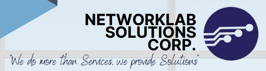

# NETWORKLAB SOLUTIONS CORP.
### *"We do more than Services, we provide Solutions"*

**IT Infrastructure • Structured Cabling • Security & Surveillance • Network Integration**

[%207004--8618-1a2b6d?style=flat-square)]()

---

## Table of Contents

- [About Us](#about-us)
- [History](#history)
- [Mission](#mission)
- [Vision](#vision)
- [Site Strategy Management](#site-strategy-management)
- [Safety and Health Policy](#safety-and-health-policy)
- [Services Offered](#services-offered)
- [Components Supply](#components-supply)
- [Accomplished Projects](#accomplished-projects)
- [Project References](#project-references)
- [Products & Brand Partners](#products--brand-partners)
- [Contact Us](#contact-us)
- [Branches](#branches)

---

## About Us

**NetworkLab Solutions Corp.** specializes in extra low voltage (ELV) equipment system design and system integration. We deliver state-of-the-art design, supply, installation, and support to meet all advanced information and technology requirements of our clients.

We are committed to implementing the latest technology and industry practices, providing solutions our clients need to succeed in today's market — while maintaining a safe and healthy working environment for both clients and the employees who make it all possible.

---

## History

**NETLAB** was formally established in **November 2018** as *NetworkLab Computer Solution* (Single Proprietorship). In **January 2023**, it became a corporation under the legal name **NetworkLab Solutions Corp.**, founded to answer and respond to clients' needs in I.T. equipment supply, technology integration, and structured and auxiliary cabling services.

Together with its partners, NetworkLab Solutions Corp. brings extensive years of experience in data communications as well as specialized services including **Security and Surveillance, PA Systems, PABX, BMS, Data Centers, and Network Infrastructure Solutions**. Our clients are served and supported by a team that has undergone extensive training and broad experience across all facets of the data communications industry — with continuous personnel training to guarantee the best the industry has to offer.

---

## Mission

> To become a leading provider of innovative and integrated service solutions, giving excellence in Supply, Deployment, Design, Installation, Commissioning, and ongoing Services.

## Vision

> To provide clients with a highly satisfactory service experience through the best quality and latest technology in the market — beyond expectation — with a timeline that meets schedules, and a safe and productive workplace for all.

---

## Site Strategy Management

Upon awarding the contract, the company organizes and sets up an effective management and supervision team structured specifically for each project. The project team is drawn from technical and management resources within the company to ensure personnel have the necessary skills to perform and satisfy clients' expectations.

Key success factors identified for every project:

- Organization
- Safety Working Environment
- Quality Measurement
- Customer Care
- Meeting all Commitments
- Completion of the project within timeline and contract specification

## Safety and Health Policy

NetworkLab Solutions Corp. is committed to providing a high level of safety and a healthy working environment for our clients, employees, and everyone in contact with our activities. We work under a competency framework that promotes safety outcomes through a culture of risk assessment, utilizing tools such as:

- Job Safety Analysis
- Task Risk Assessment
- Safety Training, Seminars, and Guidelines

---

## Services Offered

Our System Integration services include project management, design, supply, installation, testing, commissioning, and maintenance.

- Data Communications Infrastructure
- Design and Engineering Consultancy
- Project Management — Site Inspection, Survey, Conduit and Cable Installation
- Cable Termination — Network Testing and Documentation
- Commissioning and Network Maintenance Services
- Voice Data Cabling (PABX)
- Closed Circuit Television (CCTV)
- Door Access Systems
- Building Riser Backbone Installation, Coring, and Manpower Services
- Conduit Installation, Rectifications, and Restorations
- Testing, Documentation, and Commissioning

---

## Components Supply

### Telecommunication Cables (Voice & Data)
2 Pair Telephone Cable · 4 Pair Telephone Cable · UTP Cable Cat 6 & Cat 5 · Coaxial Cable · Intercom Cable · Alpeth Cable · Drop Wire · STP Cable · Fiber Optic · Flat / Line Cord · Spiral Cord (Handset Tel. Cord) · Patch Cord · RJ11 Plug Connectors · RJ45 Plug Connectors

### Security and Surveillance Equipment
PTZ Camera · Dome Camera · Bullet Camera · DVR · VMS (Video Monitoring System) · Camera Bracket

### Telephone System
Analog Handset · PABX · IP-PBX · IP Phone · Hospitality SIP-Phone

### Network Infrastructure Equipment
Switch · Router · Firewall · Access Point · Load Balancer · Server · Access Point and Controllers · Optical Network Terminals · Optical Line Terminals

### Door Access System
Magnetic Lock · Biometric · Card Reader

---

## Accomplished Projects

### Mitsubishi Motors — *CCTV Security and Surveillance Project*
Installation and termination of Cat6 components and FOC backbone, cable pulling and harnessing, camera and cabling works, outdoor FOC backbone, scaffolding erection, and data/voice cabling works.

### TOHO-Precision Molds Philippines — *"TOHO Liip Renovation" CCTV Security and Surveillance Project*
Installation and termination of Cat6 components and FOC backbone, cable pulling and harnessing, camera and cabling works, outdoor FOC backbone, scaffolding erection, and data/voice cabling works.

### Lucky 8 - Star Quest Inc. — *CCTV Security and Surveillance Project*
- **Site 1 – Liberty Building:** Installation and termination of Cat6 components and FOC backbone, cable pulling and harnessing
- **Site 2 – Talumpong Building:** Installation of camera and cabling works, FOC backbone cable pulling and termination
- **Site 3 – Lipa Villas and Clubhouse:** Outdoor FOC backbone, scaffolding erection, data and voice cabling works

### Widus Hotel and Casino — *Access Point Project*
Data center and IDF setup, termination and cable harnessing, installation of access points.

### Philippine Airforce — *Communication Project*
Communication device setup and cabling works, plus knowledge transfer and trainings.

---

## Project References

iBC · Solaire Resort & Casino · Twin Lakes Hotel · The Bayleaf Cavite · Conti's Bakeshop & Restaurant · DPWH · DSM · Philippine Air Force · TOHO · Nutrition Products · Mitsubishi Motors · Gardenia · Nippon Premium Bakery Inc. · Royale Cold Storage (RCS) · Village Gourmet · Enshored

---

## Products & Brand Partners

Fiber-Rex · G-Com Technology · Bricscad · Panduit · Cisco · Lenel · Arecont Vision · TRENDnet · SolidWorks · Vtech Hospitality Division · Sangfor · Sundray Technologies · 3CX · Panasonic · Socomec · Planet Technology USA · Tiandy · Lenovo · IBM · Microsoft · Fortinet · Citrix · Fuji Xerox DocuShare · Sophos · Acer · Hikvision · Zebra · Kofax · Ubiquiti Networks · VMware · Dell · Veeam · Brother · Hytera · ASUS · APC by Schneider Electric · Canon · Epson · HP · CommScope · LS Cable & System · Belden · Uniview · SketchUp · Adobe · SonicWall · Autodesk · ZWCAD

---

## Contact Us

| | |
|---|---|
| **Tel No.** | (02) 7004-8618 |
| **Mobile / Viber** | 0950 495 4558 · 0950 495 4693 · 0923 417 6566 |
| **Email** | support@networklabsolution.com |
| **Website** | [www.networklabsolution.com](http://www.networklabsolution.com) |

---

## Branches

**Laguna Branch**
3rd Floor, Unit 5, REDD Bldg., Blk 1 Lot 1, Olympia Ave. cor. San Vicente Road, Villa Olympia Ph1, Brgy. Maharlika, City of San Pedro, Laguna, Philippines
Tel No. (02) 7004-8618

**Bataan Branch**
REDJ Studio, #4 Burgos, Dinalupihan, Bataan

---

**NetworkLab Solutions Corp.** © 2018–2026 · *"We do more than Services, we provide Solutions"*

